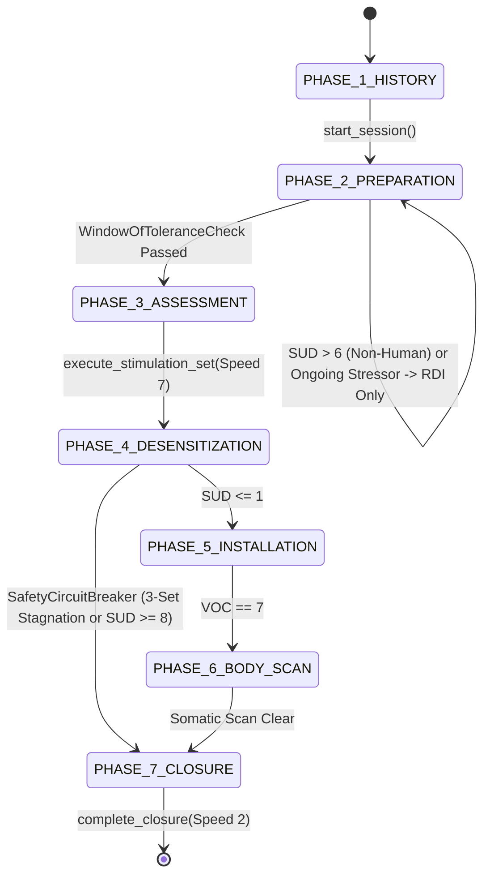

# Architecture RFC: Two-Layer Bilateral Stimulation Protocol Engine & Bi-Tapp Companion

## 1. Overview & Separation of Concerns

This RFC documents the architectural split between:
1. **Generic Framework (`framework/bls_protocol_engine/`)**: A reusable, hardware-agnostic 8-Phase EMDR state machine with deterministic clinical safety circuit breakers (`SafetyCircuitBreaker`) and zero-repo-secret local/OAuth session persistence (`GoogleWorkspaceSessionExporter`).
2. **Specific Application (`apps/bitapp_personal_emdr/`)**: A concrete instantiation tailored to the **Bi-Tapp** Bluetooth tactile tappers (`https://bi-tapp.com/`), featuring preset speed/intensity profiles, `remotEMDR` 5-character therapist control codes, and clinical target packs for (a) 2.5-year ex-partner breakup rumination and (b) Phase 2 Resource Development & Installation (RDI) for parental separation (3 children).

## 2. State Machine & Safety Invariants

## 3. Credential & Privacy Isolation

- **Zero Tracked Secrets**: Google OAuth 2.0 Installed App credentials are stored outside the repository at `~/.config/bitapp-emdr/oauth_client.json` (`chmod 600`).
- **Local-First Session Logs**: Session JSONL logs are written to `~/.local/share/bitapp-emdr/sessions/` (`chmod 700`) and excluded via `.gitignore`.
