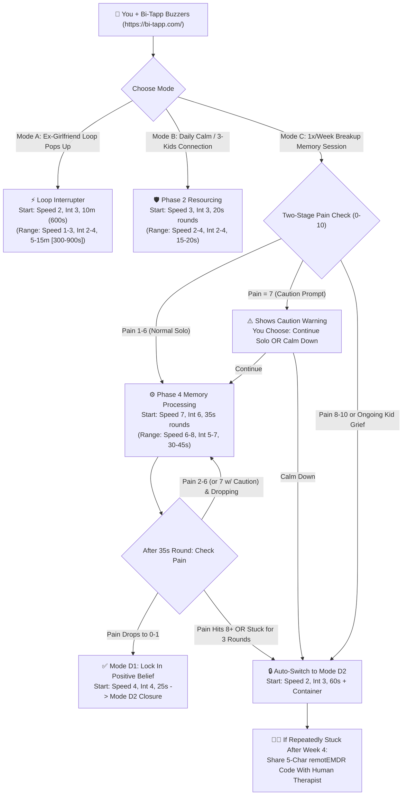

# Unified Master Plan & Clinical Guide: Bi-Tapp Tactile EMDR System (Generic Protocol Engine + Personal Treatment Companion)

* **Author**: Itay Shemesh (`itayshemesh`)
* **Repository**: `https://github.com/itayshemesh/bitapp-emdr-platform` (`main` branch)
* **Single Source of Truth**: This document unites the Clinical Treatment Guide, Hardware & Cost Breakdown, Step-by-Step Bi-Tapp Operating Manual, Two-Layer Software Architecture, Granular Task Roadmap, and Rollout Strategy into one canonical Master Plan.

---

## 1. Executive Summary & Your Chosen Operating Decisions

You are acquiring the **Bi-Tapp** wireless Bluetooth tactile bilateral stimulation (BLS) kit (`https://bi-tapp.com/`) to treat two distinct emotional challenges:
1. **The 2.5-Year Breakup Loop ("Mini-Trauma")**: Persistent, involuntary looping thoughts (rumination) about an ex-girlfriend who left 2.5 years ago.
2. **Living Apart From Your 3 Kids**: Ongoing emotional weight, role-loss, and missing your 3 children when not living under the same roof.

### Summary of Your 5 Governing Decisions
1. **Single Unified Document**: All clinical, operational, and software architecture docs are merged into this single `docs/MASTER_PLAN.md` (`docs/ARCHITECTURE_RFC.md` has been removed so there is only one source of truth).
2. **Primary Treatment Strategy — Try Solo First (Human Only If Stuck)**:
   - **Weeks 1–4 (100% Solo, $0 Session Cost)**: You start completely on your own using the Bi-Tapp buzzers and this open-source companion app—using daily calming to stop ex-girlfriend thought loops on the spot, building positive emotional anchors around your 3 kids, and running 1x/week solo EMDR sessions on manageable breakup memories.
   - **Weeks 5+ (Human Therapist Only If Stuck)**: You only book an online human EMDR therapist (who can remotely control your Bi-Tapp using its 5-character `remotEMDR` code) if specific memories stay stuck after 3 rounds, trigger the Level 8+ auto-stop, or if you want human support for the deeper grief around not living with your 3 kids.
3. **Two-Stage Pain Safety Gate (0–10 Pain Scale)**:
   - **Levels `1–6` (Green — Normal Solo Mode)**: Safe to process completely on your own.
   - **Level `7` (Yellow — Caution Prompt, Your Choice)**: The app shows a gentle warning (*"Pain level is 7/10 — proceed carefully or switch to calming mode"*) and lets **you choose** whether to continue the solo session.
   - **Levels `8–10` or 3 Stalled Rounds in a Row (Red — Automatic Stop)**: If pain hits `8, 9, or 10` (or fails to drop after 3 rounds in a row), the app **automatically stops** memory processing and switches your Bi-Tapp to **Calming Mode (`Speed 2, Intensity 3`)** so you never overwhelm yourself.
4. **Bi-Tapp Settings Format — Exact Starting Number + Comfortable Range**:
   - Every mode gives you **one exact number to start with** (so you never have to guess), plus the **safe adjustment range** right next to it (e.g., **Start at Speed `7`, Intensity `6`, `35` seconds** | *Range: Speed `6–8`, Intensity `5–7`, `30–45` seconds*).
5. **Two-Layer Software Split**:
   - **Layer 1 — Generic Framework (`framework/bls_protocol_engine/`)**: A reusable, domain-agnostic 8-Phase EMDR state machine, Two-Stage Safety Circuit Breaker, hardware adapter interface, and optional Google Workspace session logger.
   - **Layer 2 — Specific Bi-Tapp Application (`apps/bitapp_personal_emdr/`)**: Your custom Bi-Tapp speed/intensity presets, breakup rumination target pack, 3-kids positive connection pack, cost/schedule calculator, and interactive CLI runner.

---

## 2. Plain-English Explanation: Why a 2.5-Year Breakup Still Loops (And How It Connects to Your 3 Kids)

Normally, while you sleep (especially during REM dream sleep), your brain digests painful experiences and moves them from the raw emotional alarm center (the amygdala) into long-term filing cabinets where they feel like *"old history that doesn't hurt anymore."*

### Why the Ex-Girlfriend Memory Still Loops
When a painful breakup or sudden rejection hits deeply, the stress hormone surge interrupts that filing process:
* **Stuck as a "Live" File**: Scenes from 2.5 years ago stay stored with the original raw feelings, chest/stomach tightness, and painful beliefs (*"I was discarded"*, *"I am replaceable"*, *"I lost my chance"*).
* **Why Thinking Doesn't Stop the Loop**: Whenever you are alone at night or hit a quiet moment, that old file lights up as if the breakup just happened today. Your logical brain tries to "think its way out" of a physical alarm signal—which creates **endless looping thoughts**.
* **How Bi-Tapp Unsticks It**: Holding or wearing the two Bi-Tapp buzzers creates an alternating left-right pulse. Doing two things at once—briefly holding the memory in mind while feeling the left-right tapping—occupies your brain's short-term working memory, dims the vividness of the image, calms your nervous system, and helps your brain finally file the 2.5-year-old breakup into the past.

### How Living Apart From Your 3 Kids Connects to the Loop
Unlike the breakup (which happened 2.5 years ago and is over), **not living with your 3 kids is an ongoing present-day reality**.
* Quiet moments away from your children trigger the exact same "attachment loss / loneliness" alarm in your brain as the breakup.
* Often, the brain defaults to obsessing over the ex-girlfriend like a "puzzle to solve" because that feels easier than sitting with the raw ache of missing your 3 kids.
* **How We Handle Both Safely**:
  1. **For the Ex-Girlfriend Breakup (Past Event)**: We use **Mode A** (to stop daily thought loops in 5–15 minutes) and **Mode C** (once a week at fast tapping `Speed 7` to drain the pain out of specific breakup memories until they drop to `0` or `1` out of `10`).
  2. **For Living Apart From Your 3 Kids (Ongoing Reality)**: When working solo, we use **Mode B** (slow tapping at `Speed 3` for 20 seconds at a time while focusing on warm, proud moments of connection with your 3 kids) to strengthen your nervous system. We do **not** run fast solo trauma-tapping on raw grief about your kids without a human therapist, so you don't flood yourself with sadness while alone.

---

## 3. Bi-Tapp Hardware Guide & Exact Costs (`https://bi-tapp.com/`)

### 3.1 How the Bi-Tapp Device Works
* **What's in the Box**: Two sleek, rechargeable wireless Bluetooth buzzers ("tappers", `2.5" long x 0.5" wide`) that pulse alternately—Left, Right, Left, Right.
* **Hands-Free Options**: Hold them in your hands, slip them into your pockets or socks, or slide them into **Wristbands** so your hands are completely free while working, resting, or talking.
* **Phone App Sliders (Free on iOS & Android)**:
  - **Rate of Speed (`1` to `10`)**: How fast the buzzers alternate between left and right.
  - **Rate of Intensity (`1` to `10`)**: How strongly each buzzer vibrates.
* **Built-In Bridge for Online Human Therapists (`remotEMDR`)**:
  If you ever decide to book a human therapist later, open the Bi-Tapp app $\rightarrow$ **Settings** $\rightarrow$ turn on **"Allow Provider Control"** and **"Show Provider Setup Code"**. Give that **5-character code** to your online therapist on `remotEMDR.com`, and the therapist can adjust your buzzers' speed and start/stop rounds remotely over the internet during your video call.

### 3.2 Hardware Pricing Breakdown

| Item | Price (USD) | Recommendation & Notes |
| :--- | :--- | :--- |
| **Bi-Tapp Base Kit** | **$277.00** | **Required**: Includes 2 Bluetooth tappers, 2-in-1 USB charging cable, carrying pouch, and free iOS/Android app. |
| **Wristbands (Pair)** | **$20.00** | **Highly Recommended**: Lets you wear the tappers hands-free on your wrists during the day or before sleep. |
| **Wall Charger / Extra Cable** | **$15.00** | Optional USB power adapter (`$297–$312` bundled kit range). |
| **Shipping** | **$10–$15** (US) / **$40–$60** (Intl) | Estimated **~$309 USD one-time total** (Base Kit + Wristbands + US Shipping). |

---

## 4. Comparing Online Non-Human vs. Online Human Options (Solo-First Roadmap)

Your chosen plan is **Option 1 (Try Solo First for Weeks 1–4 at $0/month, and only use a Human Therapist if a memory stays stuck)**. Below is how all options compare:

| Option | How It Works With Your Bi-Tapp | Cost (USD) | Safety & Guardrails | When to Use It |
| :--- | :--- | :--- | :--- | :--- |
| **1. [SELECTED] Try Solo First (`bitapp-emdr-platform` + Bi-Tapp App)** | You control the Bi-Tapp app on your phone while our software guides you step-by-step through Calming (Mode A/B) and Weekly Memory Processing (Mode C/D). | **$0 / month** (after one-time ~$309 hardware purchase) | **Two-Stage Gate**: Pain `1–6` normal; Pain `7` shows a Caution Prompt; Pain `8–10` or 3 stuck rounds **Auto-Stops** to Calming Mode. | **Weeks 1–4 Primary Plan**: Daily loop-breaking, building positive 3-kids anchors, and clearing manageable breakup memories (`1–7`). |
| **2. Commercial Self-Guided Websites (`VirtualEMDR.com`, `Easy EMDR`)** | You pay for a web dashboard with timers/worksheets, mute their screen dot, and turn on your Bi-Tapp buzzers during rounds. | **$19 – $79 / month** | **Low-Medium**: Pre-written forms that cannot tell if you are looping on the same thought. | Optional if you want extra video tutorials, though our built-in engine covers the 8-phase workflow for **$0/mo**. |
| **3. Online Human EMDR Therapist (Backup / Phase 2 Escalation)** | You join a video call with an EMDRIA-certified therapist and share your **5-character Bi-Tapp code** so they control your buzzers remotely via `remotEMDR.com`. | • **$0 / session** via Employer EAP / Lyra Health (8–25 free sessions/yr)<br>• **$20–$60 copay** with insurance (`headway.co`, `helloalma.com`)<br>• **$150–$275** private pay | **Highest**: Therapist watches your reactions and asks targeted questions ("interweaves") to unstick stubborn loops. | **Weeks 5+ (Only If Stuck)**: Use if a core breakup memory hits Level `8+` Auto-Stop, stays stuck after 3 rounds, or for deep grief around your 3 kids. |
| **4. Virtual EMDR Intensive (2–3 Half-Days)** | Concentrated multi-hour video sessions over one weekend with a human specialist controlling your Bi-Tapp remotely. | **$1,500 – $3,000** package | **Highest** | Optional fast-track only if you ever want a specialist to clear deep history in a single weekend. |

---

## 5. How to Do It: Exact Bi-Tapp Settings (Starting Numbers + Ranges), What to Expect & Weekly Schedule

### 5.1 Master Settings Table (Exact Starting Number + Comfortable Range)

$$
\text{Bi-Tapp Profile}(p) = \begin{cases}
\textbf{Start: } (\text{Speed } 2, \text{Int } 3, 10\text{m } [600\text{s}]) \;\big|\; \text{Range: } (\text{Speed } 1\text{–}3, \text{Int } 2\text{–}4, 5\text{–}15\text{m } [300\text{–}900\text{s}]) & \text{Mode A: Stop Looping Thoughts} \\
\textbf{Start: } (\text{Speed } 3, \text{Int } 3, 20\text{s}) \;\big|\; \text{Range: } (\text{Speed } 2\text{–}4, \text{Int } 2\text{–}4, 15\text{–}20\text{s}) & \text{Mode B: Daily Calming & 3-Kids Anchor} \\
\textbf{Start: } (\text{Speed } 7, \text{Int } 6, 35\text{s}) \;\big|\; \text{Range: } (\text{Speed } 6\text{–}8, \text{Int } 5\text{–}7, 30\text{–}45\text{s}) & \text{Mode C: Weekly Memory Processing} \\
\textbf{Start: } (\text{Speed } 4, \text{Int } 4, 25\text{s}) \;\big|\; \text{Range: } (\text{Speed } 4\text{–}5, \text{Int } 3\text{–}4, 20\text{–}30\text{s}) & \text{Mode D1: Lock In Positive Belief} \\
\textbf{Start: } (\text{Speed } 2, \text{Int } 3, 60\text{s}) \;\big|\; \text{Range: } (\text{Speed } 1\text{–}3, \text{Int } 2\text{–}4, 60\text{–}120\text{s}) & \text{Mode D2: Session Closure & Calm}
\end{cases}
$$

| Mode | When to Use It | Exact Starting Setting | Comfortable Range | Step-by-Step Instructions (In Plain Words) |
| :--- | :--- | :--- | :--- | :--- |
| **Mode A: Stop Looping Thoughts on the Spot** | Anytime day or night when thoughts of your ex-girlfriend start spinning | **Speed `2`**<br>**Intensity `3`**<br>**`10 mins` (`600s`)** | Speed `1–3`<br>Intensity `2–4`<br>`5–15 mins` (`300–900s`) | 1. Turn on Bi-Tapp in your wristbands or pockets at **Speed 2, Intensity 3**.<br>2. Tell yourself: *"This is a 2.5-year-old memory firing, not an emergency today."*<br>3. Breathe in for 4 seconds, out for 6 seconds while feeling the gentle left-right pulse until the pain drops to `2` or below. |
| **Mode B: Daily Calming & 3-Kids Connection Anchor** | Every morning/evening (`10 mins`) & before any memory session | **Speed `3`**<br>**Intensity `3`**<br>**`20 sec` rounds** | Speed `2–4`<br>Intensity `2–4`<br>`15–20 sec` rounds | 1. Picture a warm, happy moment with your **3 kids** (laughing, hugging, feeling proud as their dad) or a peaceful **Safe Place**.<br>2. Notice the warm feeling in your chest.<br>3. Run **short 20-second rounds at Speed 3** *only* while the feeling stays warm and positive. Pause, breathe, and repeat 4–6 times. |
| **Mode C: Weekly Memory Processing (Phase 4)** | **Once a week** (`60–75 mins`) on a specific breakup memory (`Pain 1–6` normal; `7` caution) | **Speed `7`**<br>**Intensity `6`**<br>**`35 sec` rounds** | Speed `6–8`<br>Intensity `5–7`<br>`30–45 sec` rounds | 1. Pick **one specific snapshot** from the breakup (not the whole relationship) + the negative thought (*"I am replaceable"*) + where you feel it in your body. Rate pain (`0–10`).<br>2. Turn Bi-Tapp to **Speed 7, Intensity 6 for 35 seconds**. Just watch whatever thoughts or feelings pass by like scenery outside a train window.<br>3. **Stop the buzzers**, take a deep breath, and note: *"What is on my mind or body now?"*<br>4. Rate pain (`0–10`) and repeat 35-second rounds until pain drops to **`0` or `1`**. *(If pain stays flat for 3 rounds or hits `8+`, the app auto-stops to Mode D2).* |
| **Mode D1 & D2: Lock In Positive Belief & Close Session** | At the end of **every** Mode C session (never skip closure!) | **D1 (Belief)**: **Speed `4`, Int `4`, `25s`**<br>**D2 (Close)**: **Speed `2`, Int `3`, `60s`** | D1: Speed `4–5`, Int `3–4`, `20–30s`<br>D2: Speed `1–3`, Int `2–4`, `60–120s` | 1. **Mode D1 (When pain reaches `0–1`)**: Hold the memory together with your new positive belief (*"That chapter is over; I survived and I am moving forward"*) and run **25-second rounds at Speed 4** until the belief feels completely true (`7/7`).<br>2. **Body Scan**: Check head-to-toe for any leftover tightness and tap through it.<br>3. **Mode D2 (Always Finish Here)**: Run **60 seconds at Speed 2, Intensity 3** while picturing locking any unfinished thoughts inside a strong vault (**Container**) until next week. |

### 5.2 What to Expect & Weekly Frequency Schedule

* **Daily Routine (`10–15 mins/day`)**: Run **Mode B** every morning or before bed to keep your baseline stress low, and trigger **Mode A** on-demand (`10 mins` default; `5–15 mins` range) whenever an ex-girlfriend loop pops up.
* **Weekly Reprocessing Limit (`Strictly 1x / week, 60–75 mins`)**:
  - **Why not every day?** After a Mode C session (`Speed 7`), your brain continues rewiring that memory for **48 to 72 hours** (especially during REM sleep). Doing fast reprocessing every day overloads your nervous system.
  - **What you will feel during the 48-hour rest window**: Vivid dreams, brief waves of emotion, or sudden moments where you realize *"Wait—I haven't thought about her all afternoon, and when I do, it feels distant and flat."*
* **Your 8-Week Solo-First Timeline**:
  - **Week 1 (Setup & Calming Only)**: Receive your Bi-Tapp kit (`bi-tapp.com`). Practice **Mode A** (stopping thought loops) and **Mode B** (Safe Place, Container, and the 3-Kids Connection Anchor) daily. List 4 to 6 specific breakup memories rated from easiest (`Pain 4–5`) to hardest (`Pain 7–8`).
  - **Weeks 2–4 (Solo Memory Processing — $0 Cost)**: Once a week, run **Mode C + Mode D** on one manageable breakup memory (`Pain 4–6`, or `7` with caution). Expect each discrete memory to drop to `0–1` within 1 to 2 weekly sessions.
  - **Week 5 Checkpoint (Continue Solo vs. Book Human Backup)**:
    - If your looping thoughts are dropping steadily $\implies$ continue solo through Week 8 until all breakup memories are at `0–1`.
    - If a core memory hits the **Level 8+ Auto-Stop**, stalls for 3 rounds in two consecutive sessions, or centers on deep ongoing grief about living apart from your 3 kids $\implies$ book an online EMDRIA therapist (via Employer EAP/Lyra for $0 or `emdria.org`) and share your 5-character `remotEMDR` code.

---

## 6. Interactive Workflow & Two-Stage Safety Gate Diagram



---

## 7. Two-Layer Software Architecture (Generic Framework vs. Specific Usage)

```mermaid
flowchart LR
    subgraph Generic["Layer 1: Generic Framework (framework/bls_protocol_engine/)"]
        Schemas["schemas.py\n(Exact Start + Range Dataclasses)"]
        Safety["safety.py\n(Two-Stage SafetyCircuitBreaker:\n1-6 Normal, 7 Caution, 8+ Auto-Stop)"]
        Engine["engine.py\n(8-Phase State Machine)"]
        Adapters["adapters.py\n(StimulationAdapter ABC)"]
        Sync["workspace_sync.py\n(Private Local + OAuth Exporter)"]
    end

    subgraph Specific["Layer 2: Specific Usage (apps/bitapp_personal_emdr/)"]
        Presets["bitapp_presets.py\n(Bi-Tapp Presets + Ranges + remotEMDR)"]
        Packs["clinical_packs.py\n(2.5yr Breakup Pack & 3-Kids RDI Pack)"]
        Analyzer["options_analyzer.py\n(Solo-First Cost & Schedule Calculator)"]
        CLI["cli.py\n(Interactive Command-Line Runner)"]
    end

    Specific --> Generic
```



### Repository Layout

```
bitapp-emdr-platform/
├── README.md
├── pyproject.toml
├── .gitignore
├── docs/
│   └── MASTER_PLAN.md
├── framework/
│   └── bls_protocol_engine/
│       ├── __init__.py
│       ├── schemas.py
│       ├── safety.py
│       ├── engine.py
│       ├── adapters.py
│       └── workspace_sync.py
├── apps/
│   └── bitapp_personal_emdr/
│       ├── __init__.py
│       ├── bitapp_presets.py
│       ├── clinical_packs.py
│       ├── options_analyzer.py
│       └── cli.py
└── tests/
    ├── test_framework_engine.py
    └── test_bitapp_personal_app.py
```

### Component Responsibilities

1. **Layer 1 — Generic Framework (`framework/bls_protocol_engine/`)**:
   - `schemas.py`: Domain-agnostic `@dataclass` models (`EMDRPhase`, `BilateralStimulationConfig` with both exact starting levels and `(min, max)` adjustment ranges, `TargetMemoryNode`, `StimulationSetRecord` with `somatic_tension_clear`, `SessionSummary`).
   - `safety.py`: Domain-agnostic `SafetyCircuitBreaker` enforcing the Two-Stage Safety Gate (`caution_self_guided_sud = 7`, `auto_stop_self_guided_sud = 8`, and `stagnation_set_limit = 3`) with configurable calming and interweave prompts.
   - `engine.py`: Deterministic 8-phase state machine (`ProtocolEngine`) blocking Phase 4/5 sets if `circuit_breaker_tripped` is `True` and ensuring every session finishes with Phase 7 calming closure.
   - `adapters.py`: Pluggable `StimulationAdapter` interface with `BiTappCompanionAdapter` (emitting both Exact Starting Settings and Comfortable Ranges) and `AudioVisualSimulatedAdapter`.
   - `workspace_sync.py`: Zero-repo-secret session logger that reads your Google OAuth client config from `~/.config/bitapp-emdr/oauth_client.json` (`chmod 600`, stored strictly outside the Git repository) and writes session logs to `~/.local/share/bitapp-emdr/sessions/`.
2. **Layer 2 — Specific Bi-Tapp Application (`apps/bitapp_personal_emdr/`)**:
   - `bitapp_presets.py`: Exact starting numbers + comfortable ranges for Modes A (`600s` start, `300–900s` range), B (`20s` start, `15–20s` range), C (`35s` start, `30–45s` range), D1 (`25s` start, `20–30s` range), D2 (`60s` start, `60–120s` range), and the 5-character `remotEMDR` telehealth bridge.
   - `clinical_packs.py`: Pre-built target packs for your **2.5-Year Breakup Rumination** and **3-Children Fatherhood Connection Anchor**.
   - `options_analyzer.py`: Cost, frequency, and Solo-First roadmap calculator.
   - `cli.py`: Interactive command-line runner supporting `--mode=summary`, `--mode=loop-interrupt`, and `--mode=simulate-session`.

---

## 8. Implementation Roadmap & Granular Tasks

| Step | Task ID | Layer | Deliverable Summary | Target Files |
| :--- | :--- | :--- | :--- | :--- |
| **Phase 1** | `TASK-101` | Documentation | Author unified Master Plan & Clinical Guide (`docs/MASTER_PLAN.md`) as single source of truth. | `docs/MASTER_PLAN.md` |
| **Phase 2** | `TASK-102` | Security & Setup | Scaffold package metadata, documentation index, and strict `.gitignore` secret isolation (`~/.config/bitapp-emdr/oauth_client.json`). | `README.md`, `pyproject.toml`, `.gitignore` |
| **Phase 3** | `TASK-103` | Generic Framework | Implement domain-agnostic `@dataclass` schemas (Exact Start + Comfortable Range) and Two-Stage `SafetyCircuitBreaker` (Warning at 7, Auto-Stop at 8). | `framework/bls_protocol_engine/__init__.py`, `framework/bls_protocol_engine/schemas.py`, `framework/bls_protocol_engine/safety.py` |
| **Phase 4** | `TASK-104` | Generic Framework | Implement 8-phase `ProtocolEngine` state machine, `BiTappCompanionAdapter`, and `GoogleWorkspaceSessionExporter`. | `framework/bls_protocol_engine/engine.py`, `framework/bls_protocol_engine/adapters.py`, `framework/bls_protocol_engine/workspace_sync.py` |
| **Phase 5** | `TASK-105` | Specific App | Implement Bi-Tapp presets, 2.5-year breakup & 3-kids clinical packs, Solo-First cost/frequency analyzer, and CLI runner. | `apps/bitapp_personal_emdr/__init__.py`, `apps/bitapp_personal_emdr/bitapp_presets.py`, `apps/bitapp_personal_emdr/clinical_packs.py`, `apps/bitapp_personal_emdr/options_analyzer.py`, `apps/bitapp_personal_emdr/cli.py` |
| **Phase 6** | `TASK-106` | Verification | Implement unit and integration test suites verifying all 8 phases, Two-Stage Safety Gate, and all 5 Bi-Tapp presets. | `tests/test_framework_engine.py`, `tests/test_bitapp_personal_app.py` |
| **Phase 7** | `TASK-107` | Security Gate | Execute pre-push confidentiality and secret scan verifying zero leaked credentials or internal links. | `docs/MASTER_PLAN.md`, `.gitignore` |
| **Phase 8** | `TASK-108` | GitHub Rollout | Push feature branch and merge into `main` on `https://github.com/itayshemesh/bitapp-emdr-platform`. | `README.md`, `docs/MASTER_PLAN.md` |

---

## 9. Rollout Strategy, Verification & How to Run

### GitHub Main-Branch Rollout & Secret Isolation
1. **Single Source of Truth on `main`**: All changes are verified on `feat/generic-framework-and-bitapp-emdr`, audited for zero secret exposure, and fast-forward merged into `main` at `https://github.com/itayshemesh/bitapp-emdr-platform`.
2. **Zero Credential Check-In**: Your Google OAuth client configuration lives exclusively at `~/.config/bitapp-emdr/oauth_client.json` (`chmod 600`) outside the Git repository, and personal session logs are stored under `~/.local/share/bitapp-emdr/sessions/`.

### How to Run the Application & Verify Everything

```bash
# 1. Print your complete Bi-Tapp settings, Solo-First schedule, and cost breakdown:
PYTHONPATH=. python3 -m apps.bitapp_personal_emdr.cli --mode=summary

# 2. Run the on-demand 3-step Rumination Loop Interrupter (when thoughts of your ex start spinning):
PYTHONPATH=. python3 -m apps.bitapp_personal_emdr.cli --mode=loop-interrupt

# 3. Run an end-to-end simulated 8-phase EMDR session on a breakup memory node:
PYTHONPATH=. python3 -m apps.bitapp_personal_emdr.cli --mode=simulate-session

# 4. Run the automated unit test suite (verifies Two-Stage Safety Gate, ranges, and Solo-First plan):
PYTHONPATH=. python3 -m unittest discover -s tests -p "test_*.py" -v
```
